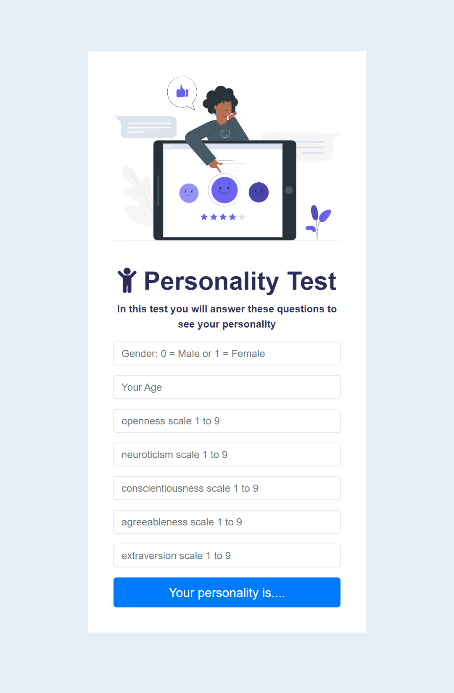
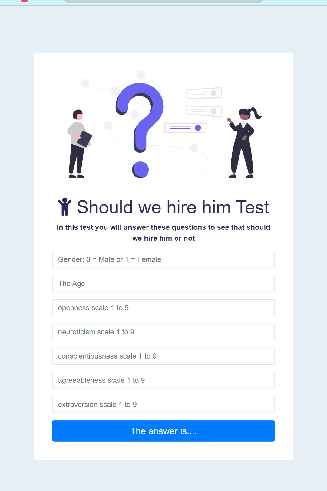
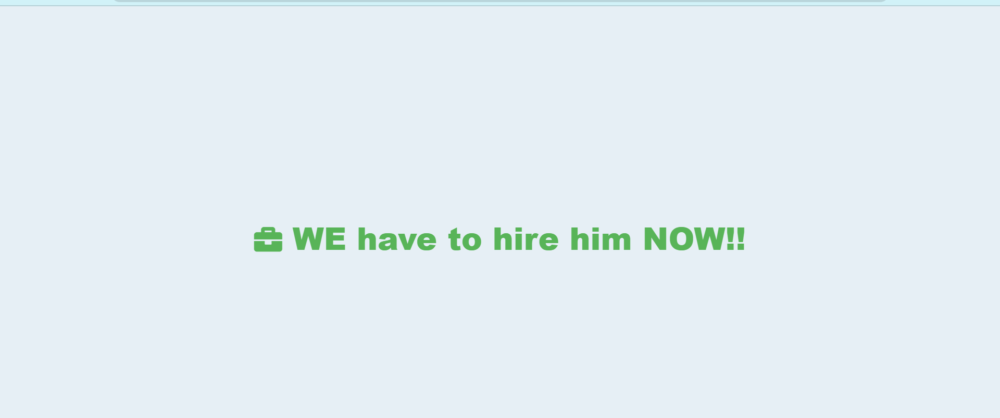

# Personality analysis
 

## analysis your personality based on:
- Gender
- Age
- openness scaled in 1 to 9
- neuroticism scaled in 1 to 9
- conscientiousness scaled in 1 to 9
- agreeableness scaled in 1 to 9
- extraversion scaled in 1 to 9

# Hiring test
 
Imagine you're an employer, and want to hire people who are specifically "responsible" or "dependable" more than anything else so this website will make easy on you because I only choose the "responsible" or "dependable" in the same data set :)

## From testing we would be hiring or not based on:
- Gender
- Age
- openness scaled in 1 to 9
- neuroticism scaled in 1 to 9
- conscientiousness scaled in 1 to 9
- agreeableness scaled in 1 to 9
- extraversion scaled in 1 to 9
## The result will be:
 
or 
 

## Data set:
I use SVM model to predict the personality and I use Random Forest on hiring test, I made a little bit of cleaning (EDA).
[the Data set](https://www.kaggle.com/datasets/pavlorymarchuk/test3434?select=test.csv)
