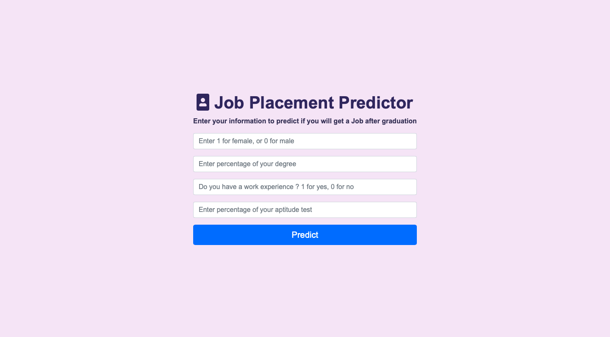
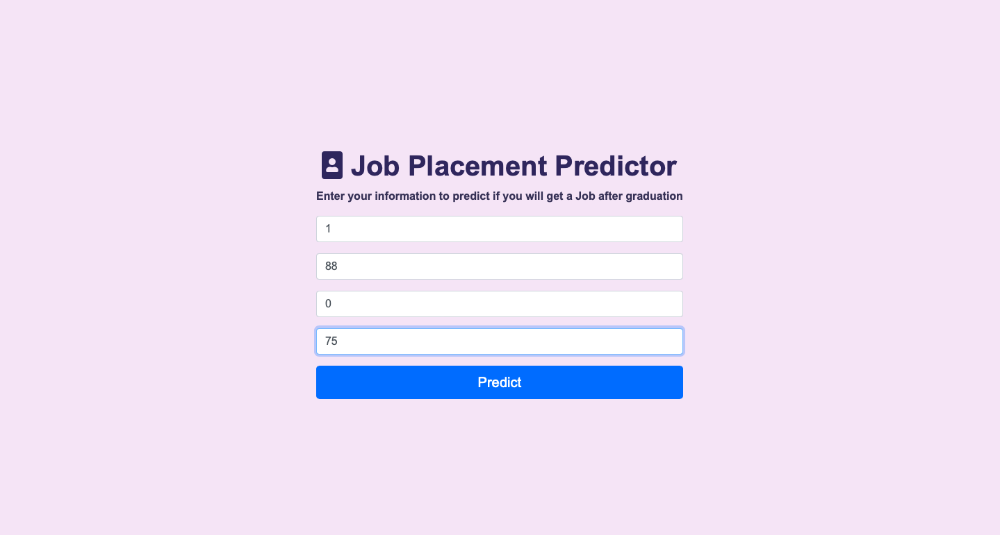

# Job Placement 

## Introduction
Due to the growing need of educated and talented individuals, especially in developing countries, recruiting fresh graduates is a routine practice for organizations. Conventional recruiting methods and selection processes can be prone to errors and in order to optimize the whole process, some innovative methods are needed.

## Dataset Overview
This [Dataset](https://www.kaggle.com/datasets/ahsan81/job-placement-dataset) contains different attribute of the candidates educational history and work experience.

## Machine Learning models

- Logistic regretion with standard scaler , Accuracy = 83% 

## Results

