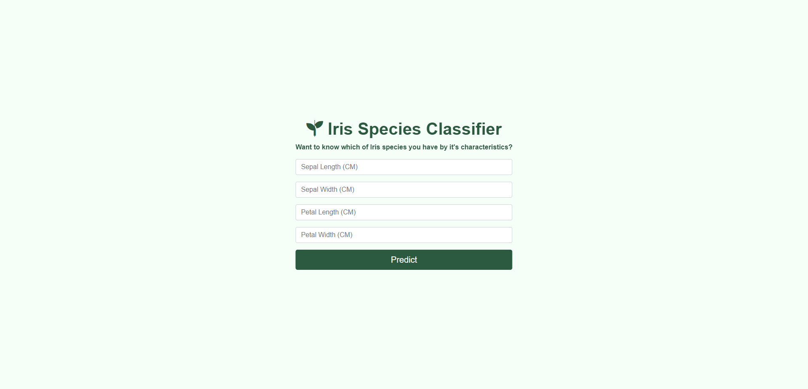

# Bootcamp-Project-5

Based on what you’ve learned about Model Deployment, choose any previous Machine Learning Model then deploy it as a website.

**Final Deliverables:**
- All files related to ML Model (Dataset, ML Model, .pkl fiels, ...etc.).
- All files related to the website (view, templates, urls, ...etc.).
- Screenshot of your final website.
- Due Date: Sun, 19 Feb, at 8:00 a.m.
> **Note:** This project is individual work.

### Screenshots

#### Home Page

#### Results

