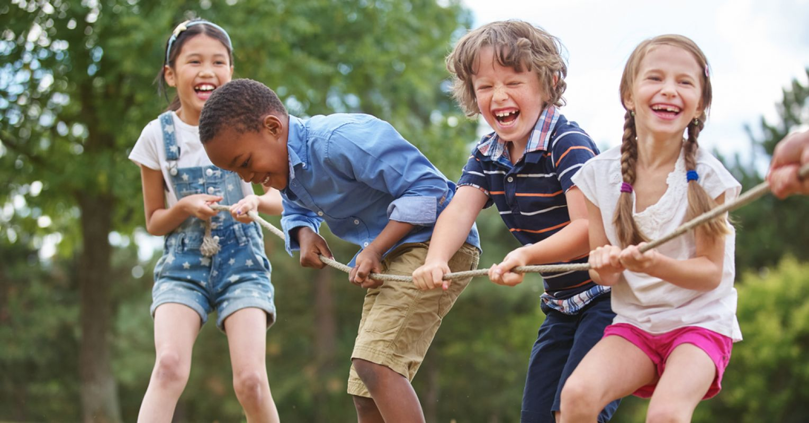

# **Kids Hobby Prediction**

### **Hobbies for kids** are healthy, beneficial, and act as both a means of self-discovery and self-expression. Hobbies help children build up confidence, set goals, and embrace the concept of downtime. They also remove children from their iPads and plug them back into a life of passion and joy.

---

### Teenagers tend to have confusion in deciding which Field/Hobby they fit in or love to do, that's why we decided to work with this Dataset.
[Dataset Link](https://www.kaggle.com/datasets/abtabm/hobby-prediction-basic)

| Features  | Meaning|
|:----------|:-------|
| Olympiad_Participation    | Has your child participated in any Science/Maths Olympiad?|
| Scholarship | Has he/she received any scholarship?|
| School | Love's going to school?|
| Fav_sub | What is his/her favorite subject?|
| Projects | Has done any projects under academics before?|
| Grasp_pow | His/Her Grasping power (1-6)|
| Time_sprt | How much time does he/she spend playing outdoor/indoor games?|
| Medals | Medals won in Sports?|
| Career_sprt | Want's to pursue his/her career in sports?|
| Act_sprt | Regular in his/her sports activities?|
| Fant_arts | Love creating fantasy paintings?|
| Won_arts | Won art competitions?|
| Time_art | Time utilized in Arts?|

---

**We have noticed that most of the results of the predictions for the child's hobby were in the academic field, and we have test several models, and the highest accuracy was Random Forest, with a percentage of 91%**
## ML Models we've used:

- **Logistic Regression**

---

## Team members and their roles:

    - Logistic Regression Model
    - DissionTree

