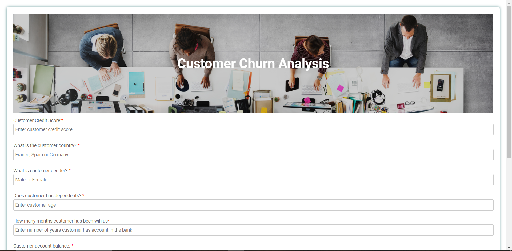

# **Bank Customer Churn Prediction**

**Churn customer analysis**, means analyzing the data to understand customer behavior in which customers may or may not unsubscribe from your company product or service. Once you identify the customers that are at risk of churn, you can determine the next step, whether to offer that customer your newest product or service or offer them a discount or coupon. Acquiring new customer requires any company more asset than keeping an existing customer within the company, and due to that churn analysis and prediction is important. In this project, I used bank customer data to determine whether the customer has the risk of churn or not.

## **Dataset Description:**

The data was an open dataset from [Kaggle](https://www.kaggle.com/datasets/gauravtopre/bank-customer-churn-dataset),
whit 10000 record and 12 columns.

**Features Description:**
This dataset is for ABC Multistate bank with following columns:
- customer_id, unused variable.
- credit_score, used as input.
- country, used as input, Country of Residence.
- gender, used as input.
- age, used as input.
- tenure, used as input, From how many years he/she is having bank acc in ABC Bank.
- balance, used as input, Account Balance.
- products_number, used as input, Number of Product from bank.
- credit_card, used as input, Is this customer have credit card ?.
- active_member, used as input, Is he/she is active Member of bank ?.
- estimated_salary, used as inpu, Salary of Account holdert.
- churn, used as the target. 1 if the client has left the bank during some period or 0 if he/she has not.

## **Screenshoot of the websit**

